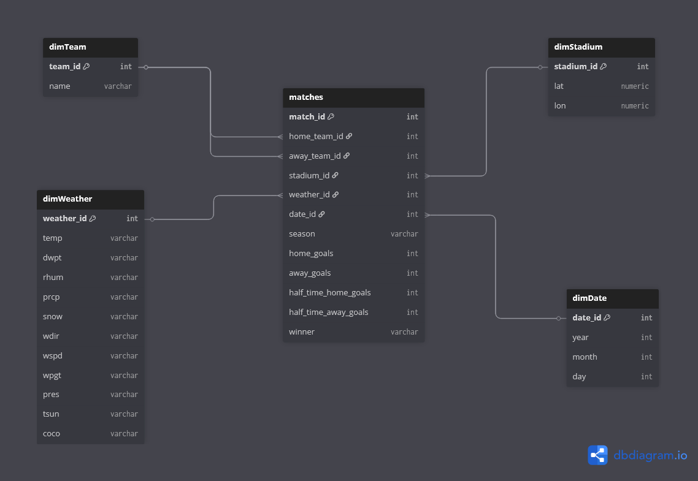

# LaLiga Football Data Warehouse
## Overview
Data warehouse created for analysis of mainly the **weather impact on football matches** in spanish football.

Data collected with public APIs and meteostat python library -> Transformed with python -> Stored in SQL Server Data Warehouse
## Data Sources
- Matches data: [football-data](https://www.football-data.org/)
- Stadium coordinates: [wikidata](https://www.wikidata.org)
- Weather data: [meteostat](https://meteostat.net/en/)
## Tools / Technologies
| Layer | Tool |
|-------|------|
| Data Fetching | Python (`requests`, `dotenv`) |
| Transformation | Python (`pandas`) |
| Storage | Microsoft SQL Server |
| Visualization | Power BI |
| Diagram | dbdiagram.io |
## Warehouse Schema

